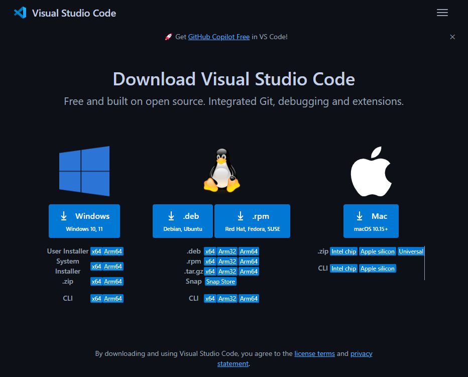
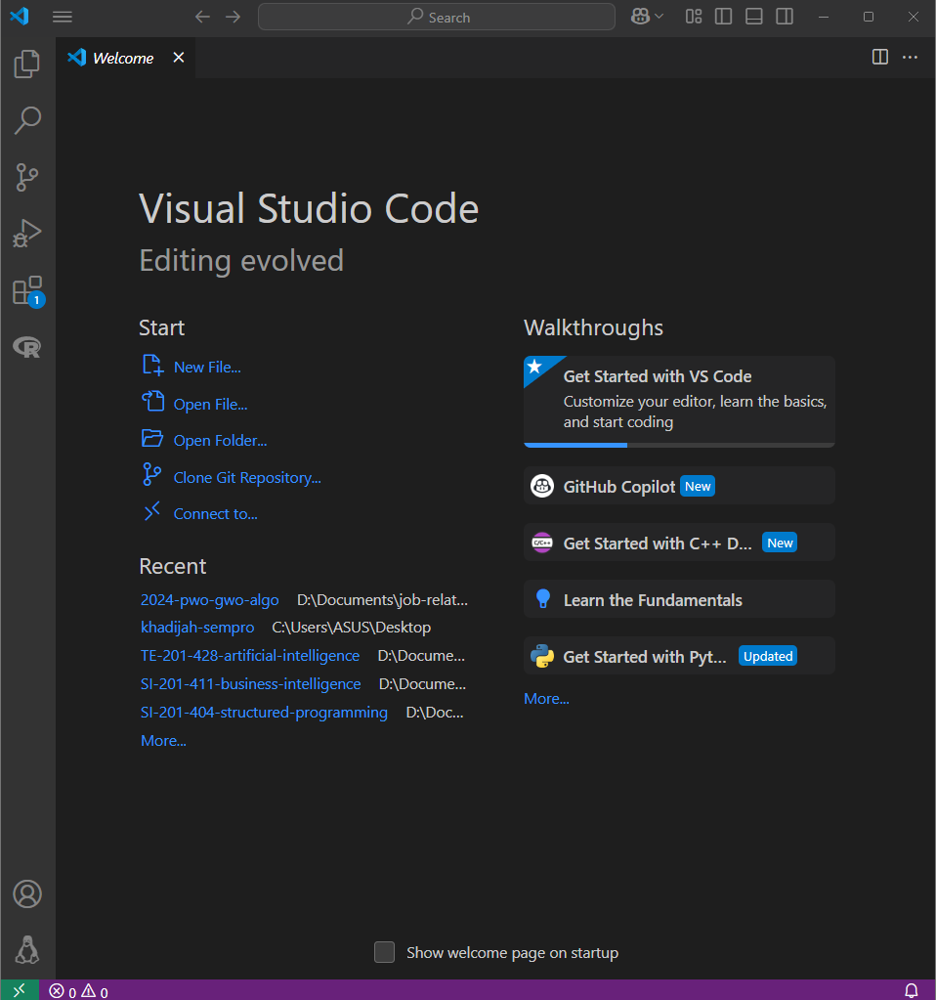
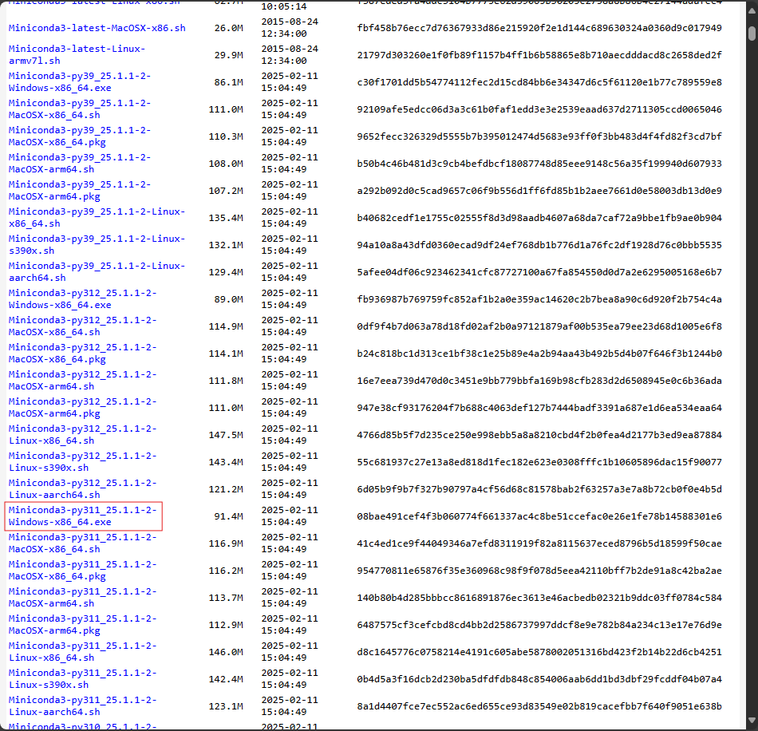
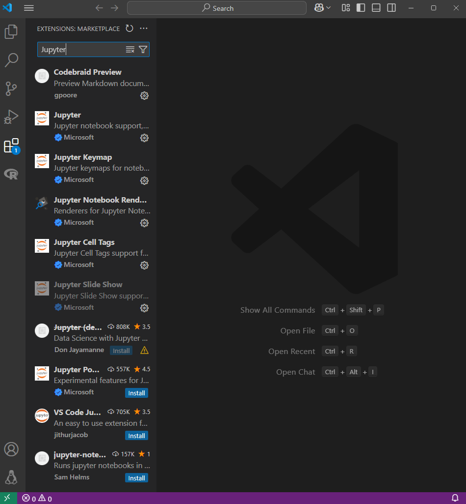

# Installation

The following tutorial is the installation of all the tools that you need
to run all program during the course. We divided the installation steps into
two parts. First is the installation of Python through Miniconda, and we use it
through Jupyter Notebook inside VSCode. This tutorial has been tested under
Windows 11 24H2. The last part is the installation of Jupyter Notebook 
via VSCOde extensions and the necessary libraries
like `numpy`, `matplotlib` and `pandas`. Other libraries will follow the
similar procedure for its installation.

We use VSCode because it is more lightweight than using PyCharm or Spyder 
and it supports Jupyter Notebook with a full of ease by installing it
through VSCode extension.

## First thing you need to do
1. Uninstall all Python's related programs such as PyCharm, Anaconda, and 
   Python. There is a possibility that you have a Python program that resides
   outside the Anaconda and Miniconda.

2. To remove them, you can uninstall in "Add or Remove Program" menu

3. Please follow carefully all the steps. Most of the students missed the step 
   and made many typoes in entering the commands

## VSCode and Python installation

### VSCode

We need VSCode to run the interface of Jupyter Notebook and to do command editing. 
To insall it, we can proceed with theh following steps.
1. First, download VSCode installer from https://code.visualstudio.com/Download. 
   Choose the insaller for Windows 11. (If you use Windows 10, MacOS or Linux, 
   please choose the appropriate version).

   

2. Follow the instructions that are given during installation processes. 
   You can click "Next" or "Yes'. After the installation has been done, the
   "Welcome Page" will be shown. If it is not shown like in the figure, open 
   VSCode application manually from Start Menu.

   

At this moment, VSCode has been installed to your computer, and we ready to 
continue to the next steps which is Miniconda installation.

### Miniconda

Miniconda is a smaller version that its parent program, Anaconda. This program 
is used to manage Python version that is installed to your computer. Se we can 
have many version of Python programs and different version of installed libraries. 
This can be achieved by using what is so called "environment". Most developers
use single environment for a single project. 

When we have an environment, we can install libraries without any worries
about dependency conflicts between Python version and its installed 
libraries version. In this course, we onnly use "base" environment which is 
the default environment. There are steps to set a new environment with different 
Python's version and libraries. You can explore more about this environment 
management in [Miniconda/Anaconda documentation](https://docs.conda.io/projects/conda/en/stable/user-guide/getting-started.html)

In here, we only install for Windows users. Please follow carefully each step.

1. Visit the download page of Miniconda in 
   https://repo.anaconda.com/miniconda/. Then select 
   `Miniconda3-py311_25.1.1-2-Windows-x86_64.exe`.

   

2. (optional) If you want to check that the downloaded filed is really the 
   intended Miniconda installer, we can verify it using SHA256 by typing 
   the following command in Windows PowerShell. First you need to direct the 
   directory of PowerShell into the location of the downloaded file of 
   Miniconda installer. You can use command `cd`. Now type this

   ```text
   Get-FileHash .\Miniconda3-latest-Windows-x86_64.exe -Algorithm SHA256
   ```
   
   Then, check if the code of SHA256 that is produced with the above command is 
   the same as the code in the download page. If it is not the case, your
   downloaded file is not authentic at all. It has been tampered by someone 
   and it is not safe to install it in your computer.

3. Double click to the Miniconda installer file 
   (`Miniconda3-latest-Windows-x86_64.exe). During the installation, use
   default setting.

4. After the installation is finished, you can find a program with the name
   "Anaconda Prompt (Miniconda 3)" from the Start Menu. Open that program to 
   initiate the base environment

   

At this point, you have installed VSCode and Python and ready to continue for 
the installation of VSCode extensions and Python modules.

### Jupyter Notebook and other extension and Python modules

To be able opening, editing, and running Jupyter Notebook files, we need to 
install these three extension
1. Jupyter (by Microsoft)
2. Python (by Microsoft)
3. Markdown Preview Github Styling (by Matt Bierner)

Make sure that the above extensions that you are going to install have the 
same name for its author (the name inside the parenthesis). There are many
extensions that share the same name but different author's name.

The following steps are only for Jupyter Notebook installation. For other
extensions follow the same procedure to install them.

1. Open VSCode, left click on the extension icon (an icon that is represented 
   with four small blocks where the single block in the upper right is shifted).

   

2. In the "Search box", type "Jupyter". Then left click to the blue button
   "Install". If you have done the installation for this extension, that blue
   button will not appear. You can continue the same steps for the two other
   extensions.

3. Reopen "Anaconda Promp (Miniconda 3)" from the Start Menu, and type the 
   following commands to install Python modules in the base environment.
   Make sure that in the console, there is a pre-text `(base)` that shows
   you are in the "base" environment.

   ```text
   pip install ipykernel numpy==1.26.4 matplotlib pandas
   ```

4. (optional) In the later weeks, we will use some Python modules. 
   All installations can be done by using `pip` command.
   Please check and read how to install the following modules
   - `scikit-opt`: https://scikit-opt.github.io/scikit-opt/#/en/README?id=quick-start
   - `scikit-fuzzy`: https://pythonhosted.org/scikit-fuzzy/userguide/getting_started.html
   - `tensorflow`: https://www.tensorflow.org/tutorials


### Troubleshooting

- This problem arise in Windows 10 that "Detecting kernels" took so long to complete.
  You need to add these two Paths:
  ```
  C:\Users\<your-username>\miniconda3
  C:\Users\<your-username>\miniconda3\Scripts
  ```
