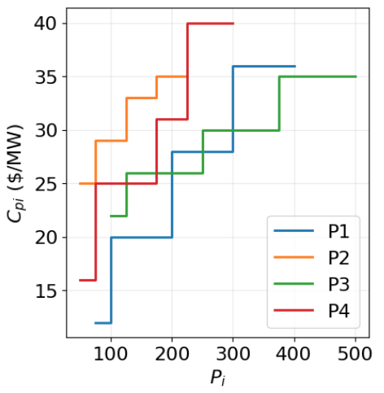
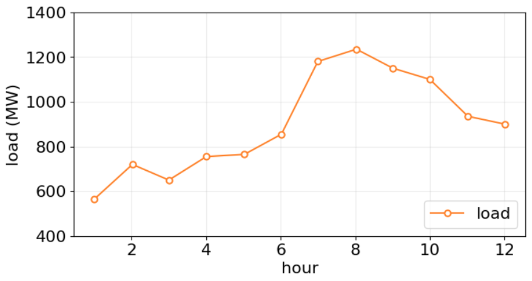

Economic load dispatch is a popular problem in electrical engineering
fields that solves how to allocate the total electricity demand (load)
among various available power generations unit in a way that minimizes
the overall cost of production while meething system constraints.

Given the following minimization problem of economic dispatch load 
and its constraints
$$
\min\left( \sum C_{pi} P_i + \sum C_{ri} R_i\right),
  \quad i = 1, 2, \ldots, N
$$

Subject to constraints:
$$
\begin{align*}
\left\{
  \begin{aligned}
    &P_\text{load} - \sum P_i = 0, \\
    &P_{i,\text{min}} \leq P_i \leq P_{i, \text{max}}, \\
    &DR_i \,\Delta t \leq P_{i}^{t+1} - P_i^t, \quad
      \text{ for } P_i^{t+1} < P_i^t, \quad t = 1, 2, \ldots, T  \\
    &UR_i \,\Delta t \geq P_i^{t+1} - P_i^t, \quad
      \text{ for } P_i^{t+1} > P_i^t, \quad t = 1, 2, \ldots, T \\
    &\sum R_i \geq R_\text{min} 
  \end{aligned}
\right.
\end{align*}
$$    
where    
$i, N$ = generator number, and total number of generators    
$t, \Delta t, T$ = time interval, duration of time and maximum time horizon,
  respectively   
$C_{pi}, C_{ri}$ = the price of power output and reserve of generator $i$, 
  respectively    
$P_i, R_i$ = power output and reserve of generator $i$, respectively    
$P_\text{load}$ = load demand     
$P_{i, \text{min}}, P_{i, \text{max}}$ = minimum and maximum output of generator 
  $i$, respectively   
$DR_i, UR_i$ = the down ramp and up ramp limit of generator $i$, respectively    
$R_\text{min}$ = minimum reserved requirement

Solve them with these data
- number of generator, $N = 4$ units
- duration of time, $\Delta t = 1$ hour
- maximum time horizon, $T = 12$ hours
- the price of power output
  $$
    C_{P1} = 
    \begin{dcases}
      12, \quad 75 \leq P_1 < 100, \\
      20, \quad 100 \leq P_1 < 200, \\
      28, \quad 200 \leq P_1 < 300, \\ 
      36, \quad 300 \leq P_1 \leq 400
    \end{dcases}
    \qquad
    C_{P2} = 
    \begin{dcases}
      25, \quad 50 \leq P_2 < 75, \\
      29, \quad 75 \leq P_2 < 125, \\
      33, \quad 125 \leq P_2 < 175, \\ 
      35, \quad 175 \leq P_2 \leq 225 
    \end{dcases}
  $$
  $$
    C_{P3} = 
    \begin{dcases}
      22, \quad 100 \leq P_3 < 125, \\
      26, \quad 125 \leq P_3 < 250, \\
      30, \quad 250 \leq P_3 < 375, \\ 
      35, \quad 375 \leq P_3 \leq 500
    \end{dcases}
    \qquad
    C_{P4} = 
    \begin{dcases}
      25, \quad 50 \leq P_4 < 75, \\
      29, \quad 75 \leq P_4 < 175, \\
      33, \quad 175 \leq P_4 < 225, \\ 
      35, \quad 225 \leq P_4 \leq 300
    \end{dcases}
  $$

  or representing in a plot   
  

- the price of reserve of generator, $C_{ri} = 25\%P_\text{load}$
- minimum output, maximum output, down ramp limit, 
  and up ramp limit of generator
  | generator | $P_\text{min}$ | $P_\text{max} $ | $DR$ | $UR$ |
  |-----------|----------------|-----------------|------|------|
  | $P_1$     | 75             | 400             | -95  | 70   |
  | $P_2$     | 50             | 225             | -110 | 90   |
  | $P_3$     | 100            | 500             | -135 | 100  |
  | $P_4$     | 50             | 300             | -75  | 60   |

- load demad as a function of time, $P_\text{load}$
  | $i$ | $P_\text{load}$ |
  |-----|-----------------|
  |   0 |  565 |
  |   1 |  720 |
  |   2 |  650 |
  |   3 |  755 |
  |   4 |  765 |
  |   5 |  855 |
  |   6 | 1180 |
  |   7 | 1235 |
  |   8 | 1150 |
  |   9 | 1100 |
  |  10 |  935 |
  |  11 |  900 |

  or representing in a plot  
  

- minimum reserved requirement, 
  $R_\text{min} = 25\% P_\text{load}$

The unknown variables, for $t = 1, \ldots, 12$, are:   
- $P_\text{load}, P_1, P_2, P_3, P_4$ and 
- $R_\text{min}^{t}, R_1^t, R_2^t, R_3^t, R_4^t$.   

In total there are 120 variables (= 10 $\times$ 12) that you need to find out using
GA or PSO.